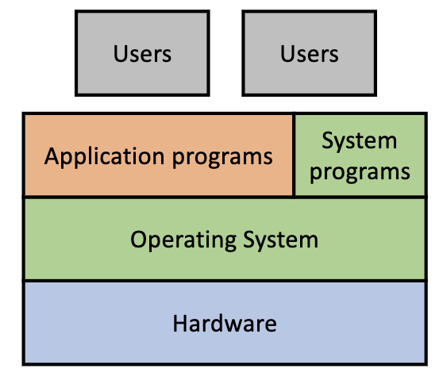

# SUSTech CS302: Operating System

# 1. Intro

### How a Modern Computer Works?

- a single, shared memory for programs and data
- a single bus for memory access
- an arithmetic(same means with “compute”) unit
- a programe control unit

### **Structure** of a Computer System

Computer system can be divided into four components

- HardWare
- Operating System
- Application programs
- Users

### Kernel

- A software included in OS.
- manages all the physical devices
- exposes some functions such as system calls for others.

### OS

- A ********************************Resource Manager.********************************
- A ********************************Control Program********************************

### **What Does an Operating System Do?**

- **Virtualization:** CPU and Memory
- **Concurrency:** multi thread
- **Persistence:** crash-resilience

## Concepts:

- ********************Process:******************** a program in execution.