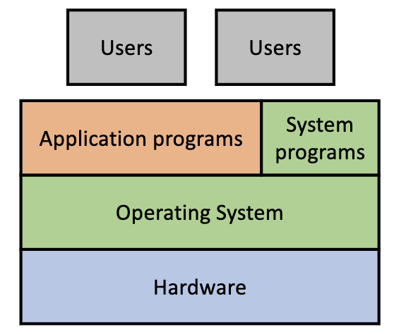
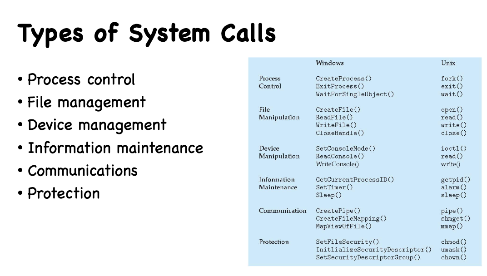
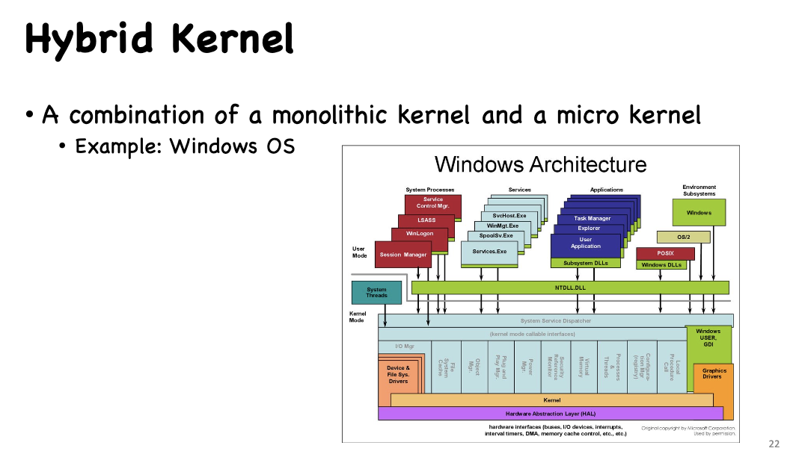
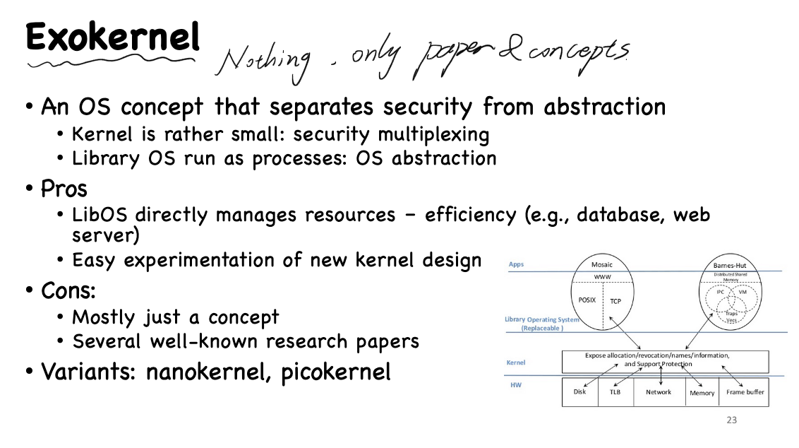
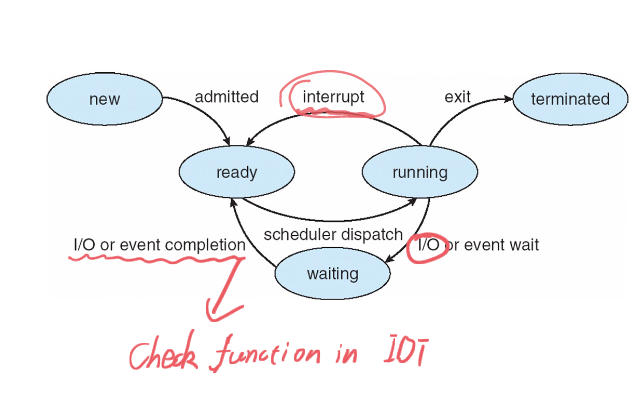
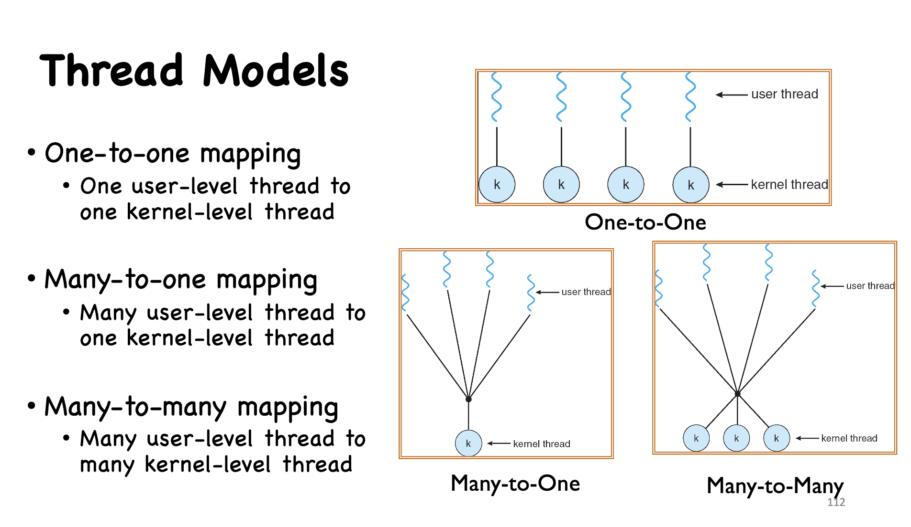
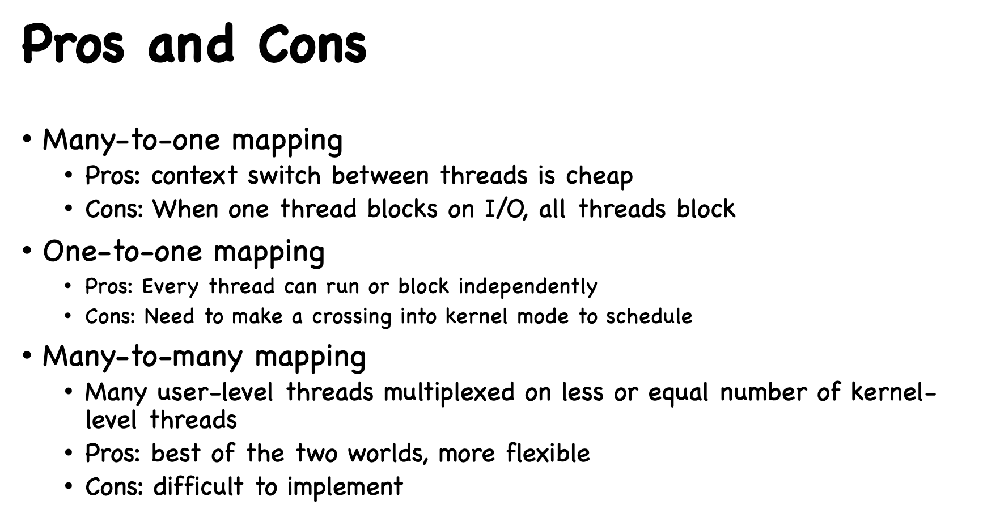

# SUSTech CS302: Operating System Lec1 - Lec3

[TOC]

# 1. Intro

### How a Modern Computer Works?

- a single, shared memory for programs and data
- a single bus for memory access
- an arithmetic(same means with “compute”) unit
- a programe control unit

### **Structure** of a Computer System

Computer system can be divided into four components

- HardWare
- Operating System
- Application programs
- Users

  

### Kernel

- A software included in OS.
- manages all the physical devices
- exposes some functions such as system calls for others.

### OS

- A **Resource Manager.**
- A **Control Program**

### **What Does an Operating System Do?**

- **Virtualization:** CPU and Memory
- **Concurrency:** multi thread
- **Persistence:** crash-resilience

## Concepts:

- **Process:** a program in execution.

# 2.  OS Basics

## 2.1: Dual-Mode Operations

Dual-mode (two modes) → **user mode** & **kernel mode**

### 2.1.1: 3 types of Mode Transitions

- System Call
- Interrupt
- Trap or Exception

#### System Calls

##### Types of System Calls (Mark):

  

#### Exception (synchronous) and Interrupt (asynchronous)

理解：

异常（Exception）同步于app运行发生。异常是执行某个指令中触发的。异常产生后，CPU会立即停止当前的工作，转去执行异常处理程序。

中断（Interrupt）是执行完某个指令后触发的。CPU会在完成当前的指令后切换到中断处理程序。

## 2.2 Kernel Structure

### 2.2.1 Monolithic Kernel

- Holds ==all privileges== to access I/O devices, memory, hardware interrupts and the CPU stack.
- Contains many components.
- Basis of ==Linux, Unix, Ms-DOS== (Mark)

### 2.2.2 Micro Kernel

- Outsource some function to user processes.
- These user-level servers are trusted by kernel.

### 2.2.3 Hybrid Kernel & ExoKernel

  
  

### 2.2.4 OS Design Principles (Mark)

- **User goals**: operating system should be convenient to use, easy to learn, reliable, safe, and fast

- **System goals**: operating system should be easy to design, implement, and maintain, as well as flexible, reliable, error-free, and efficient25

- **OS separates policies and mechanisms**

  - Policy: which software could access which resource at what time
    - E.g., if two processes access the same device at the same time, which one goes first
    - E.g., if a process hopes to read from keyboard

  - Mechanism: How is the policy enforced

    - E.g., request queues for devices, running queues for CPUs

    - E.g., access control list for files, devices, etc.

  - The separation of policy from mechanism is a very important principle, it allows maximum flexibility if policy decisions are to be changed later26

## Operating System Services

### Operating System Services

- User Interface (UI)
- Program execution
- I/O operations
- File-system manipulation
- Communications
- Error detection
- Resource allocation
- Accounting
- Protection and security

# 3. Processes

- PID: process's unique ID number

### Process Life Cycle

  

**Notice:** A process ==can not== change directly from running to ready.

### System Call: Parameter Passing (Mark)

- Registers

- Blocks: stores in a block, and ==address== is passed by registers.

- Stack: parameters pushed to stack by ==program==, and poped out by ==operating system==

  

### 3 ways of process switch (Mark)

- Syscall

- Exception

- Interrupt

  

### Syscalls about Processes

**Note: ** One Process can **only be** created by ==another process==

#### 1. fork()

- In ==parent process==, it returns subprocess's **PID**;

  While In ==subprocess== created by fork() , it returns **0**.

- copy on write: subprocess **shares the same memory** with its parent process **unless** ==subprocess's memory== is ==**modified**==.

#### 2. exec()

**Note: **Exec() will **clear** origin process.

For example, process A do exec() to execute process B, then the rest of process A won't execute continually.

#### 3. wait() & waitpid

- Codes after wait() will execute after subprocess **terminated**.
- waitpid() do same thing with wait(). It waiting for a specific pid.

#### 4. exit()

- **Zombie Processes:** after exit(), process will not been recycled immediately until its parent **reap** it.

- After a process exit, a signal(SIGCHILD) will be broadcast.

- if its parent receive the signal, it will "**reap**" signal sender(sub-process, the "zombie").

  

**Mark:** exit() system call turns a process into a zombie when...

- The process calls exit().
- The process returns from main().
- The process terminates abnormally.
  - The kernel knows that the process is terminated abnormally. Hence, the kernel invokes exit() for it.

### PCB(Process Control Block)

- **PCB**: Information associated with each process.

  

### **Threads** and **Process** :

Process can have multiple threads. Threads in a process shared **codes**, **heap** and **files**, but have their own **stacks** and **registers**.

#### Thread Implementation

- User-level thread
  - Thread management (e.g., creating, scheduling, termination) done by user-level threads library
  - OS does not know aboutuser-level thread

- Kernel-level thread
  - Threat management done by kernel.
  - OS is aware of each kernel-level thread.

#### Thread Models.

  

  

