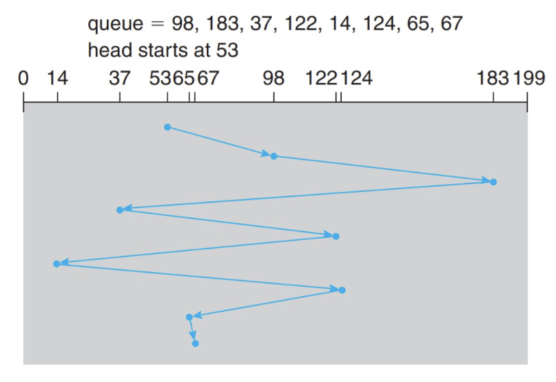
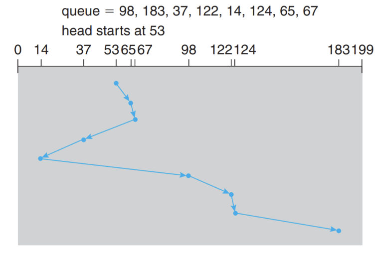
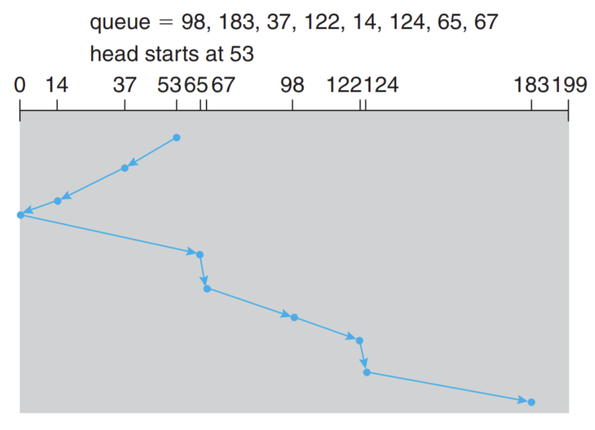
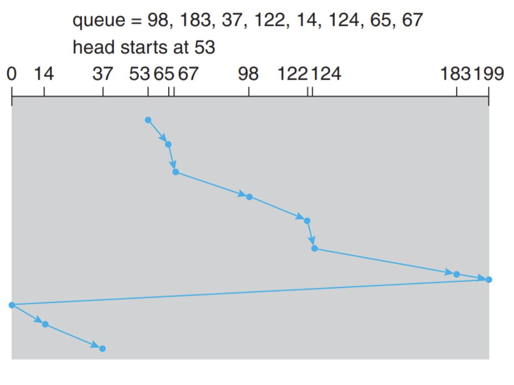

# SUSTech CS302: Operating System Lec10 - Lec11

[TOC]

# Basic IO: Polling

To write a byte of data to device

- Step 1: OS waits until the device is ready to receive a command by
  repeatedly reading the status register;
- Step 2: OS sends some data down to the data register;
- Step 3: OS writes a command to the command register
- Step 4: OS waits for the device to finish by again polling it in a loop, waiting to see if it is finished

### Cons: 

- Inefficient
- If CPU switches to other tasks, data may be overwritten

## Efficient I/O: Interrupts

- Instead of polling the device repeatedly, the OS can issue a request, put the calling process to sleep, and context switch to another task.
- When the device is finally finished with the operation, it will raise a hardware interrupt, causing the CPU to jump into the OS at a predetermined interrupt handler

## Pros & Cons (Mark) 

- Polling works better for fast devices 
  - Data fetched with first poll
- Interrupt works better for slow devices
  - Context switch is expensive
- Hybird approach if speed of the device is not known or unstable
  - Polls for a while
  - Then use interrupts

## Programmed I/O

- Explicit I/O instructions
- Memory-mapped I/O

## DMA

- used to **avoid** programmed I/O for large data movement

理解：有DMA的系统进行IO时，IO过程由DMA管理，CPU只负责发送信号给DMA & 接受DMA报告完成的信号

# Storage

## Magnetic Disk

### Read sector from random place on disk

- Assumptions
  - Ignoring queuing and controller times for now
  - Avg seek time of 5ms,
  - 7200RPM &rarr; Time for rotation: 60000 (ms/minute) / 7200(rev/min) &asymp; 8ms
  - Transfer rate 4MByte/s, sector size 1 Kbyte Þ 1024 bytes/4×106 (bytes/s) = 256 × 10-6 sec @ .26 ms

T = Seek (5ms) + Rot. Delay (4ms) + Transfer (0.26ms)

## Disk Scheduling

### FIFO

  

### SSTF (Shortest Seek Time First)

  

### SCAN (elevator algorithm)

  

### C-SCAN

  

### LOOK & CLOOK

​		Same as SCAN&CSCAN, but arm only goes as far as the last request in each direction, then reverses direction immediately, without first going all the way to the end of the disk

 

 