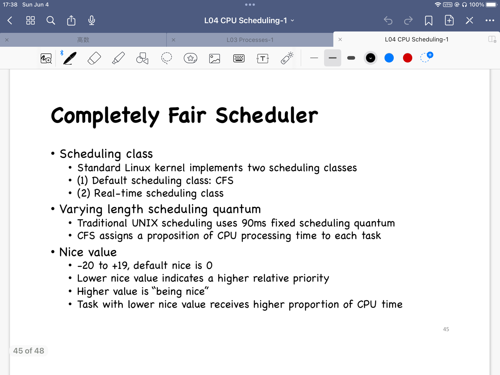
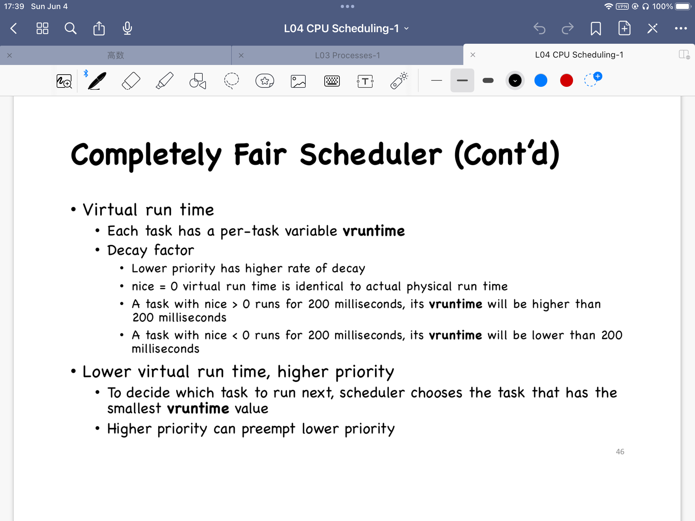
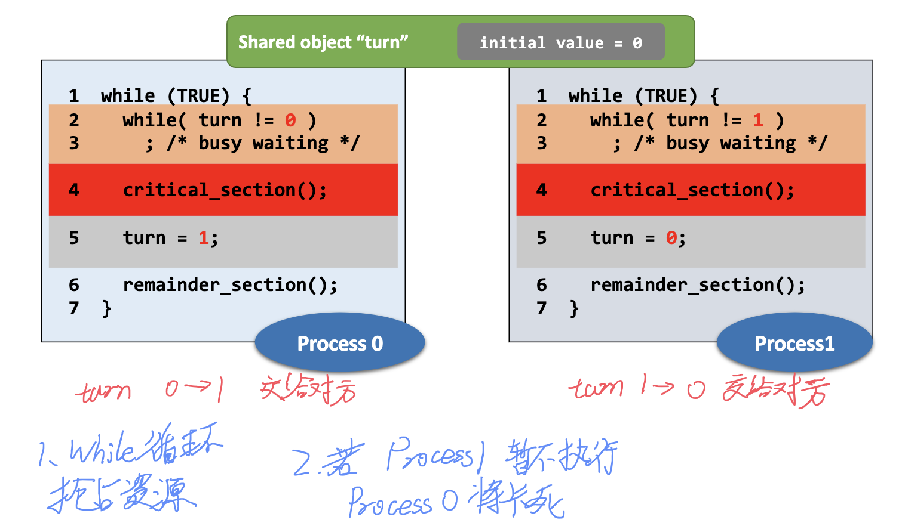
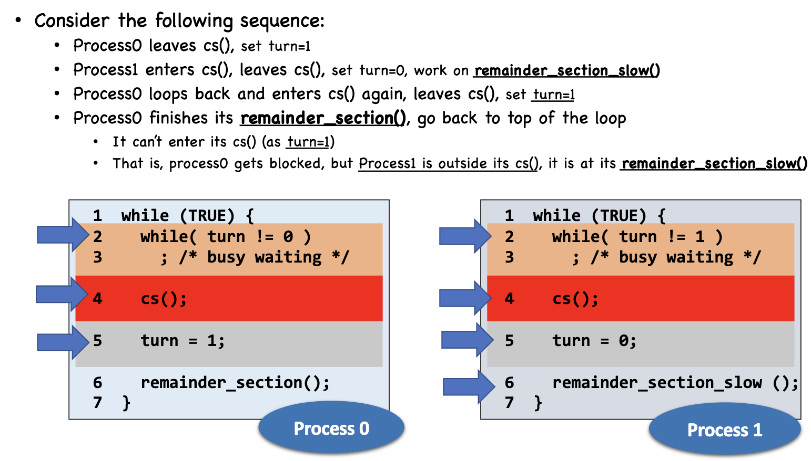
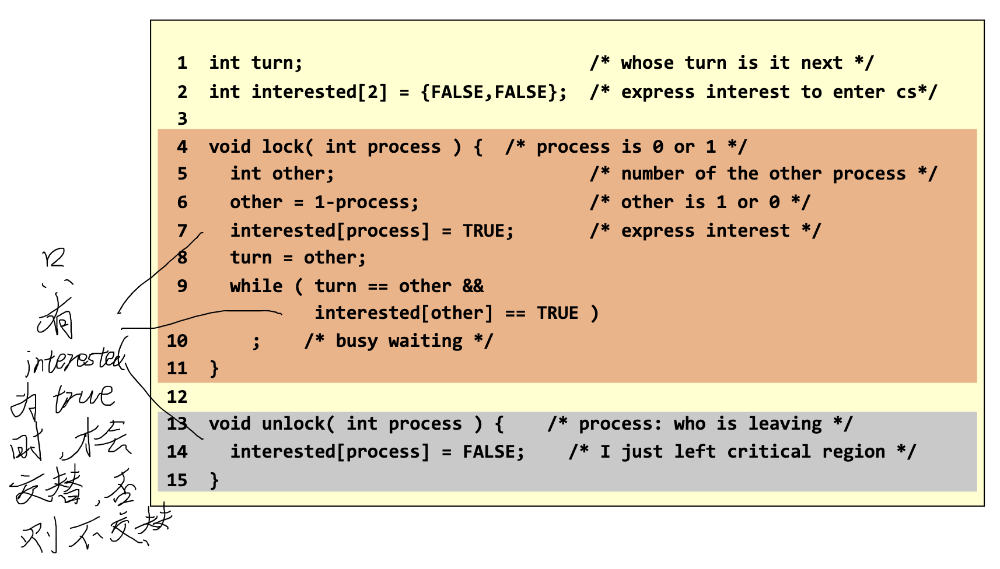
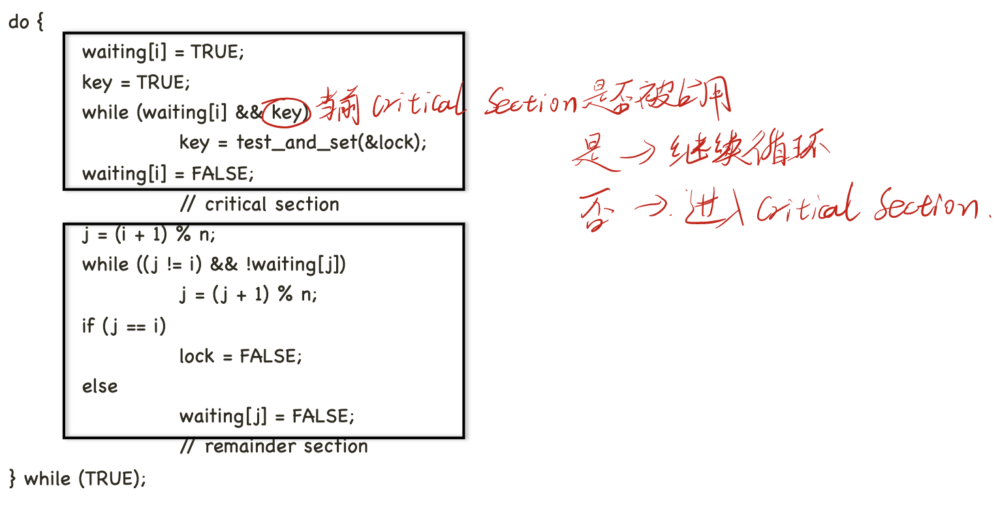
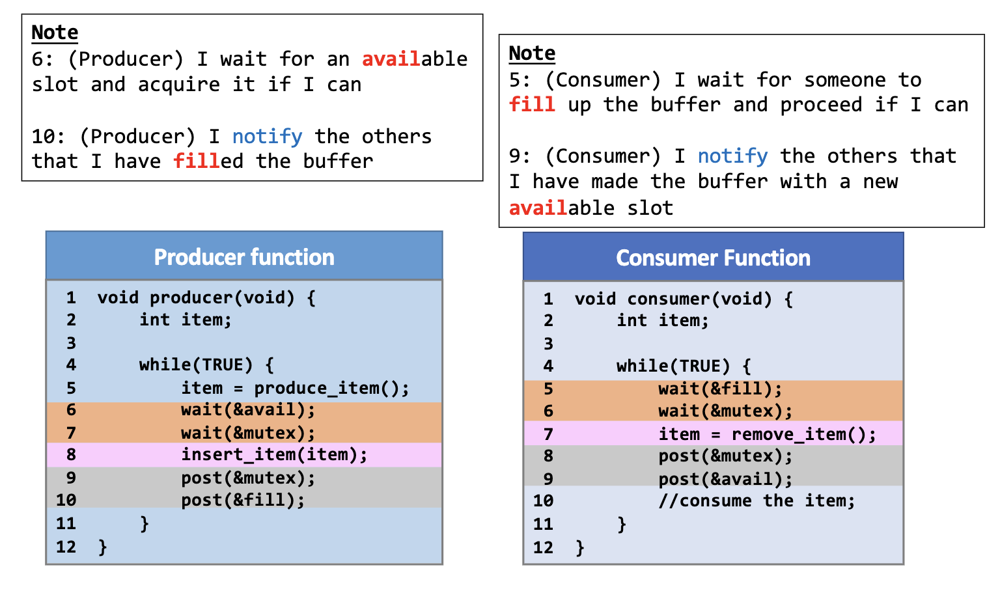

# SUSTech CS302: Operating System Lec4 - Lec5

[TOC]


# 4. CPU Scheduling


## Two types of processes

- CPU bound
- I/O bound


## Preemptive and Non-Preemptive

**CPU Scheduling** will happens when:

1. Switches from running to waiting state
2. Switches from running to ready state
3. Switches from waiting to ready
4. Terminates

- **Non-Preemptive:** Scheduling happens in **case1** and **case4**

- **Preemptive:** All other scheduling.

理解：抢占式调度算法不会管前一个进程是否执行完毕。例如，假设进程A需要执行两个时间片，但当其执行到第二个时间片时其优先级低于进程B；非抢占式算法会等待A执行完毕，但抢占式算法会直接将CPU给进程B使用。


## Scheduling Algorithm

- **Turnaround time:** time between the arrival of the task and the time it is blocked or terminated.
- **Waiting time:** Accumulated time that a task has waited in the ready queue.


### Shortest Job First (SJF)

Choose the job have least **CPU remaining time**.

- Preemptive SJF
- Non-Preemptive SJF


### Round Robin

- Process is given a **quantum**.
- If the **quantum** is used up, process will be replaced and **pushed back** to the ==<font color='red'>**tail**</font>== of the ready queue

- New process will be pushed back to the tail of the ready queue, too.


### Priority Scheduling

- **Priority:** smallest integer == highest priority.
- Non-preemptive and preemptive are **both** OK.

#### Starvation: low priority processes may never execute

- **Solution:** Aging. priority will increase by time.


### Completely Fair Scheduler

<p align='center'>
  
  
</p>


# 5. Synchronization


## Why we need Process Communication?

Process may also need to communicate with each other

- Information sharing:
  - e.g., sharing between Android apps 
- Computation speedup:
  - e.g., Message Passing Interface (MPI) 

- Modularity and isolation (between multi-process):
  - e.g., Chrome’s multi-process architecture


## Race Condition

The **outcome** of an execution depends on ==<font color='red'>**a particular order**</font>== in which the shared resource is accessed.


### Solution: Mutual Exclusion (互斥)

<font color='red'>**Do not**</font> access the “shared object” <font color='red'>at the same time</font>.


### Critical Section

code segment that access **shared objects**.


#### Requires 

- Requirement #1. **Mutual Exclusion**
  - ==<font color='red'> **No two processes could be simultaneously go inside their own critical**
    **sections.**</font>==
-  Requirement #2. **Bounded Waiting**
  - Once a process **starts trying to** enter its critical section, there is **a bound** on **the number of times** other processes can **enter** theirs.
- Requirement #3. **Progress**
  - Say **no** process ==<font color='red'>**currently**</font>== in critical section.
  - **One of** the processes trying to enter will ==<font color='red'>**eventually get in**</font>==.


### Implementation: Locks

- Spin-based locks
- Sleep-based locks


## Spin-Based Locks


### Theory & Negs

<p align='center'>
  
</p>


### Spin-Based Locks: Not "Progress"

#### Example:

<p align='center'>
  
</p>

### Peterson's Solution

<p align='center'>
  
</p> 

### Multi-Process Mutual Exclusion

<p align='center'>
  
</p> 


### Problem: Priority Inverse

- A low priority process L is ==inside== the critical region, but ...
- A high priority process H ==gets the CPU== and wants to enter the critical region.


## Sleep-Based Lock: Semaphore

- Semaphore: an **integer** count for the **number** of **available resources**.

### Implement

```C
void sem_wait(semaphore *s)
{
	s->value = s->value - 1;
	if (s->value < 0
	{
		sleep();
	}
}

void sem_post(semaphore *s)
{
	s->value = s->value + 1;
	if(s->value <= 0)
		wakeup(); // 唤醒某个处于等待队列中的, 处于sleep状态中的进程
}
```


### Application: Producer-Consumer Problem

<p align='center'>
  
</p>  


### Application: Dining Philosopher

思路：假设五个哲学家，五只筷子

将筷子视为资源， 哲学家视为进程： 每个进程运行前会先索取左边的资源，再索取右边的资源。当有一个资源无法被满足时（即将进入sleep），进程会释放左右两边的资源，再sleep一会。

#### Problem: What if processes require for resource at same time?

如果哲学家们同时拿起了左边的筷子，同时寻找右边的筷子，同时发现右边筷子用不了，再同时睡一会，再同时醒过来，再同时拿起左边的筷子。。。

#### Final Solution

思路：将信号量**设为进程本身**，而不是资源

由一个“captain”管理。当一个进程请求资源时，captain将会检查此进程左右两边的相邻进程是否正在运行（占有资源）。如果是，则captain会让请求资源的进程sleep一会；否则将资源分配给该进程。

==同时只能有一个进程向captain发起请求。==


