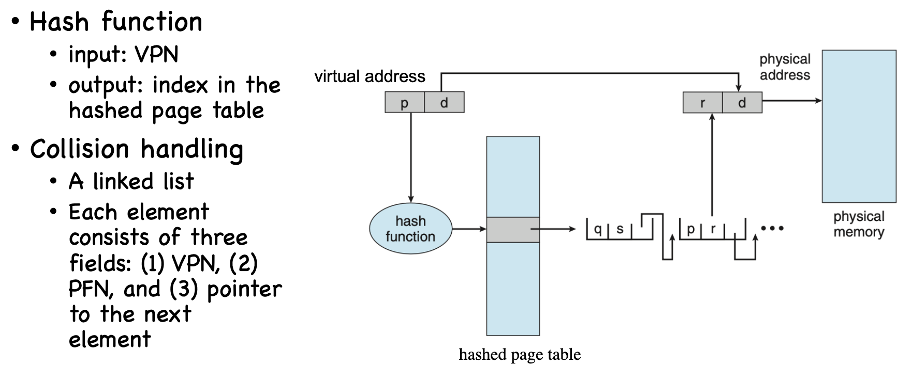

# SUSTech CS302: Operating System Lec6 - Lec9

[TOC]

# 6. Address Translation

## Segments in an address space

- Code Segment: Stores instructions
- Stack Segment: local variables, arguments, return values.
- Heap Segment: malloc

==Stack stores **Left Values**, while Heap stores **Right Values**.==

## Bit Representation - Big endian & Little endian  (Mark)

Big endian and little endian

- 32-bit int at 0x8c
- big endian: 0x d1 4a f5 83
- little endian: 0x 83 f5 4a d1

  
  

 

## Memory Virtualization Requires  (Mark)

A mechanism that virtualize memory should 

- Be transparent
  - Memory virtualization should be invisible to processes
  - Processes run as if on a single private memory
- Be efficient
  - Time: translation is fast
  - Space: not too space consuming
- Provide protection
  - Enable memory isolation
  - One process may not access memory of another process or the OS kernel
  - Isolation is a key principle in building reliable systems

## Notice: the actual calculation of address translation is done by MMU, rather then operating system.

## Address Translation

### Base & Bounds

Two hardware registers [SS74] 

- base register
- boundsregister(also called a limit register).
- Process A, e.g., base 320KB, bounds 64KB

  

 

### Segmentation

- A pair of Base & Bound.
- Each segmentation have a ==Base & Bound Register==

#### Best Fit

- choose most fit chunk from free list.

- **Pros:** satisfied with minimize externel fragmentation

- **Cons:** slow

  

#### Worst Fit

- choose the biggest chunk from free list
- **Pros:** maximize externel fragmentation. == Maybe the fragmentation can fit other process's request==

- **Cons:** 
  - slow
  - 赌怪最终必将一无所有

#### First Fit

- choose the first fit chunk from free list
- **Pros:** Fast
- **Cons:** Only fast. The begining of the free list will be polluted with small chunks.（big size的request就需要遍历到free list的较后方，耗时会更长）

理解：选第一个满足的，那free list的最开始肯定是最容易被选的。而small size的request又更容易找到fit chunk, 就会导致free list的最开始全是小碎块。

# 7. Paging

## Address Mapping

Virtual Address = Virtual Page Number || Offset

In case of m-bit virtual address and k-bit offset

- Size of address space: $2^m$
- Size of a page: $2^k$
- e.g., 32-bit virtual address, 4KB page: m = 32, k = 12

## PTE (Page Table Entry)

- Entry in a page table. Each **contains** a ==page mapping relationship==

(Mark) PTE contains ==**a valid bit, protection bits, an access bit, a dirty bit and a present bit**==

**Notice:** Normally size of a page table is **equal** to page size. (for example, 4KB)

## Solution of the too-big page table: Multi-level Page Tables

- two level Page table:

  

    
  

**Notice:** Multi-level Page Tables do a == **pruning**== to avoid big page table.

理解：二级/三级页表只有在需要的时候才会申请内存。

## Other Page Table Structures (Mark) 

### Hashed Page Tables

  

 

### Inverted Page Tables

  

 

## Real World Paging Schemas

### In RISC-V (Mark) 

  

 

#### SV39 (Mark) 

  

 

- A PTE in SV39 takes 8 bytes (64 bits)

  - Bit 8-0 status bits
  - Bit 53-10 is PFN ( or physical page number, PPN)
  - Bits 63-54 reserved

- The 9 status bits

  - D (dirty), A (accessed), V (valid)
  -  G (Global): G=1 the page is mapped in all address spaces
  - U (User): U-mode code may access this page
  - RSW: reserved for s-mode

  

    
  

### IA-32 (Intel's 32-bit CPU) (Mark)

  
  

  

## Translation Lookaside Buffer (TLB)

- A Cache of PTEs, stores PTEs **likely** to be used.
- **Based On:**
  - **Spatial locality:** closed in space.
  - **Temporal locality:** closed in time.

### Issues: Two process may use the same virtual address (Mark) 

Example:

- P1: 100 -> 110
- P2: 100 -> 170

Solution:

- Flush TLB upon context switch
  - Invalidate all entries: V->I
- Extending TLB with address space ID
  - No need to flush tlb

# 8. Demand Paging

## Swap Space

- a partition or a file stored on the disk

- OS **swap** pages between ==**memory**== and ==**Swap Space**==

  

## Page Fault

### Present bit

PTE have a present bit. 

If **presen bit** is **1**, page address to **physical memory**

else if **presen bit** is **0**, page address to **disk**.

### Page Fault

Present bit=0 &rarr; raises a page fault

#### Page Fault Handler

1. Find free page frame in physical memory
2. Fetch page from disk and store it in physical memory

##### Find free page frame in physical memory

- if no free page, trigger a ==**page replacement**==

#### Progress graph (Mark) 

  

 

## Page Replacement Policy

### Effective Access Time (Mark) 

- Example:
  - Memory access time = 200 nanoseconds
  - Average page-fault service time = 8 milliseconds
  - Suppose p = Probability of miss, 1-p = Probably of hit
  - Then, we can compute EAT as follows:

$$
EAT\ =(1-p)\times 200ns+p\times8ms \\
\ \ \ \ \ \ \ \ \ \ \ \ \ \ \ \ \ \ \ \ \ \ \ \ = (1-p) \times 200ns + p \times 8,000,000ns
$$

#### Belady's Anomaly (Mark) 

  

 

### Replacement Policies

- **Optimal**: replace page not be used for the longest time  **(Only in theory ! ! ! )**

- **FIFO**: First In, First Out.

- **RANDOM**: random.

- **LRU:** Least Recently Used.

- **LFU:** Least Frequently Used.

  

### Clock Algorithm

理解：每个PTE有一个reference bit. 当replacement 发生时，OS会先访问“指针”处的PTE。若指针指向的PTE reference bit 为0，替换此PTE；否则将reference bit 置为0，并移动到下一位PTE

**Notice:** 替换PTE的reference bit是由**CPU**进行的！！！

### Allocation Algorithms (Mark) 

  

 

# 9. Linux Memory Management

## Why is kernel memory mapped into the address space of each process?

- No need to change page table (i.e., switch CR3) when trapped into the kernel – no TLB flush
- Kernel code may access user memory when needed

**Notice:** **kernel memory** in each address space is **the same**.

## Large Page Support

- 基页 （4KB)， 巨页（2MB)，吉页（1GB）
